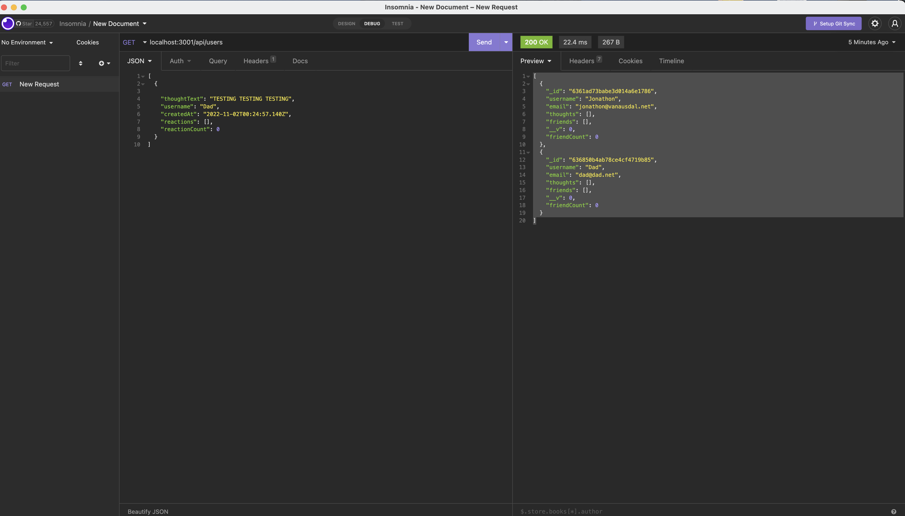

# # Title: # Mongo-_db_18_hw

## Discription:
* Mongo-Db allows is an API for a social network. It allows user to create and share their thoughts, react to friends and create a friends list.
- What was your motivation? - Way to create api's for a mongo nosql database. 
- Why did you build this project? - To create an API for a user to create and share thoughts using mongodb. 
- What problem does it solve? - able to use api's calls to use CRUD operations in a nosql database. 
- What did you learn? - learned how to use CRUD operations for a nosql database. 

## Table of Contents (optional)
- [Installation](#installation)
- [Usage](#usage)
- [Credits](#credits)
- [License](#license)

## Installation:
- What are the steps to install your project?
* run npm start and use CRUD operations in insomnia. 

## Usage:
Add a screenshot, create an `assets/images` folder in your repository and upload your screenshot to it. Then, using the relative filepath, add it to your README using the following syntax: !'[alt text](assets/images/screenshot.png)'
screenshot: 

## Credits:
* Collaborators: n/a
* Assets: n/a
* Tutorials: youtube.com
* Features: n/a
## Links:
* Github link: https://github.com/jonathonvanausdal9915/Mongo-_db_18_hw
* 
* video link: https://drive.google.com/file/d/18bqQplj3khBhC9wnBC_hwAL1FWar6Ewz/view?usp=sharing